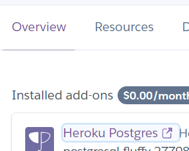
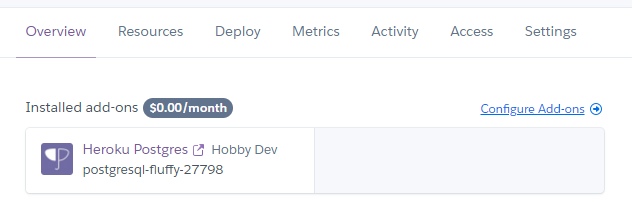
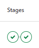

# Movie Characters API

The application are constructed in Spring Web and comprise of a database made in PostgreSQL through Hibernate
with a RESTful API to allow users to manipulate the data. The database store information about characters, movies
they appear in, and the franchises these movies belong to.

## Installation

### Repository

The application is free to clone straight from gitlab. Type this into your selected git console to get the current main
version:

```
git clone git@gitlab.com:VeronicaAndersen/movie-characters-api.git
```

### IDE software

To run and use this repository you can use a software that you like. This one was build in IntelliJ IDEA and are using
spring boot with plugin Gradle.

## Setting up locally database connection

In the file located in src/main/resources/application.properties enter the following:

```
spring.datasource.url = <YourHost>:5432/<NameOfYourDatabase>
spring.datasource.username = <UsernameForDatabase>
spring.datasource.password = <PasswordForDatabase>

spring.jpa.properties.hibernate.dialect = org.hibernate.dialect.PostgreSQL95Dialect
spring.jpa.hibernate.ddl-auto = create
logging.level.org.hibernate.state = trace
spring.jpa.show-sql = true
spring.sql.init.platform = postgres
spring.jpa.defer-datasource-initialization = true
spring.sql.init.mode = always
springdoc.swagger-ui.operationsSorter = method
```

Replace these with yours database credentials. You will find these under heroku Overview:
1. Click Heroku Postgres

    
2. Click settings and replace these four with the credentials that shows. 
- YourHost
- NameOfYourDatabase
- UsernameForDatabase
- PasswordForDatabase

## Deployment [Docker & Heroku]

https://experis-java-movie-api-va-jo.herokuapp.com/swagger-ui/index.html#/

In the terminal write this commands:
```
1. heroku login
2. docker build -t <NameOfDocker> .    
3. docker run -p 8085:8080 <NameOfDocker>    
4. heroku create --region eu --app <NameOfDeployment>
5. heroku container:login    
6. heroku container:push web --app <NameOfDeployment>   
7. heroku container:release web --app <NameOfDeployment>    
```

### Testing in Postman

In Postman you can test if it works with:
http://localhost:8085/api/v1/movie

That will show some JSON data like:

```
{
        "id": 1,
        "title": "Harry Potter and the Sorcerer´s Stone",
        "genre": "Fantasy, Adventure",
        "releaseYear": 0,
        "director": "Chris Columbus",
        "picture": "https://www.imdb.com/title/tt0241527/mediaviewer/rm3145094400/?ref_=tt_ov_i",
        "trailer": "https://www.imdb.com/video/vi3115057433?playlistId=tt0241527&ref_=tt_ov_vi",
        "movie_characters": [
            1,
            2,
            3
        ],
        "franchise": 1
    }
```

### Heroku

Configure Add-ons called Heroku Postgres in heroku under Overview.



### Gitlab

Make sure that both stages for build & deploy are passed under CI/CD Pipelines.




## Contributors

Johanna Olsson @johannaolsson & Veronica Andersen @VeronicaAndersen
